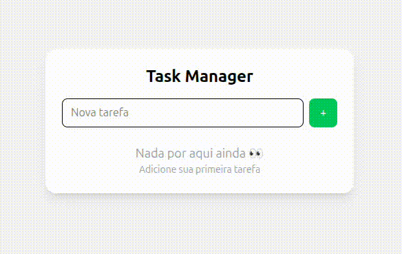

<h1 align="center">🚀 Task Manager Fullstack</h1>

  Aplicação fullstack moderna para gerenciamento de tarefas, com foco em arquitetura limpa, boas práticas e experiência do usuário.

  <!-- Badges -->
  
  
  
  
  
  

---

<h2 align="center">🎬 Demo</h2>

  

---

<h2>📌 Sobre o Projeto</h2>

Este projeto foi desenvolvido com o objetivo de consolidar conhecimentos em desenvolvimento fullstack, aplicando conceitos modernos utilizados no mercado.

A aplicação permite gerenciar tarefas com persistência real em banco de dados, integrando frontend e backend de forma desacoplada.

---

<h2>🧠 Arquitetura</h2>

<pre>
Frontend (Vue + Pinia)
        ↓
API REST (Spring Boot)
        ↓
PostgreSQL
</pre>

O backend segue uma arquitetura em camadas:

<ul>
  <li>Controller → expõe endpoints REST</li>
  <li>Service → contém regras de negócio</li>
  <li>Repository → acesso ao banco</li>
  <li>DTO → camada de transporte (desacoplamento)</li>
</ul>

---

<h2>🛠️ Tecnologias</h2>

<h3>Frontend</h3>
<ul>
  <li>Vue 3 (Composition API)</li>
  <li>TypeScript</li>
  <li>TailwindCSS</li>
  <li>Pinia (state management)</li>
  <li>Vite</li>
</ul>

<h3>Backend</h3>
<ul>
  <li>Java 17</li>
  <li>Spring Boot</li>
  <li>Spring Data JPA</li>
  <li>Hibernate</li>
  <li>DTO Pattern</li>
  <li>Bean Validation</li>
</ul>

<h3>Banco de Dados</h3>
<ul>
  <li>PostgreSQL</li>
</ul>

---

<h2>✨ Funcionalidades</h2>

<ul>
  <li>✔ Criar tarefas</li>
  <li>✔ Listar tarefas</li>
  <li>✔ Marcar como concluída</li>
  <li>✔ Remover tarefas</li>
  <li>✔ Persistência de dados</li>
</ul>

---

<h2>📂 Estrutura do Projeto</h2>

<pre>
backend/
 ├── controller
 ├── service
 ├── repository
 ├── dto
 ├── domain
 └── exception

frontend/
 ├── components
 │    ├── atoms
 │    ├── molecules
 │    └── organisms
 ├── views
 ├── stores
 ├── services
 └── types
</pre>

---

<h2>⚙️ Como rodar localmente</h2>

<h3>🔹 Backend</h3>

<pre>
cd backend/taskmanager
./mvnw spring-boot:run
</pre>

Servidor: <strong>http://localhost:8080</strong>

---

<h3>🔹 Frontend</h3>

<pre>
cd frontend/task-manager-frontend
npm install
npm run dev
</pre>

Aplicação: <strong>http://localhost:5173</strong>

---

<h2>🔌 Configuração do Banco</h2>

Configure o arquivo <code>application.properties</code>:

<pre>
spring.datasource.url=jdbc:postgresql://localhost:5432/taskdb
spring.datasource.username=taskuser
spring.datasource.password=123456
</pre>

---

<h2>📈 Diferenciais</h2>

<ul>
  <li>✔ Arquitetura limpa e escalável</li>
  <li>✔ Separação de responsabilidades (DTO)</li>
  <li>✔ Validação de dados no backend</li>
  <li>✔ Tratamento global de erros</li>
  <li>✔ Integração real frontend + backend</li>
  <li>✔ Componentização com Atomic Design</li>
</ul>

---

<h2>🚀 Roadmap</h2>

<ul>
  <li>🔒 Autenticação (JWT)</li>
  <li>🌐 Deploy em produção</li>
  <li>📄 Paginação e filtros</li>
  <li>🎨 Melhorias de UI/UX</li>
</ul>

---

<h2>👨‍💻 Autor</h2>

<strong>Rhuan Lucas Carvalho</strong>

Desenvolvedor Frontend / Fullstack em formação.

---

<h2>📬 Contato</h2>

Sinta-se à vontade para entrar em contato ou dar feedback 🚀

